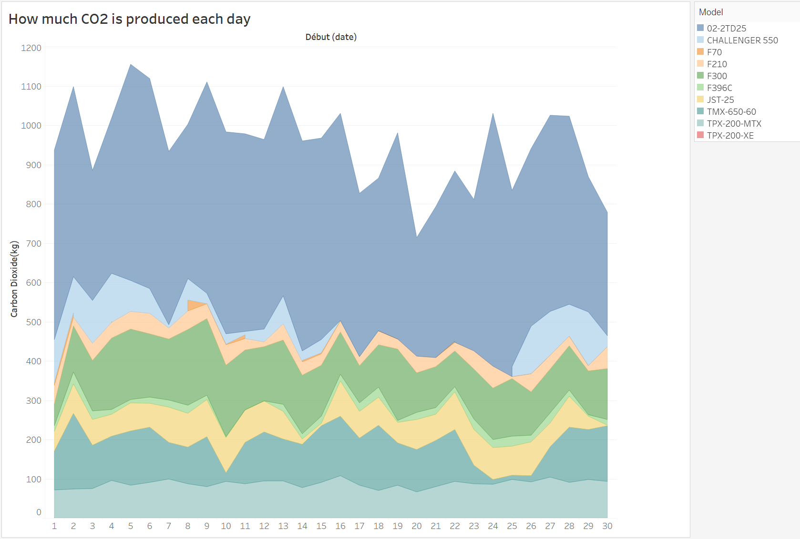
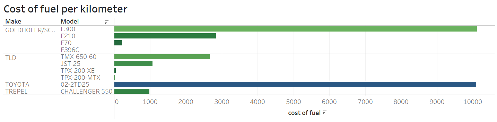
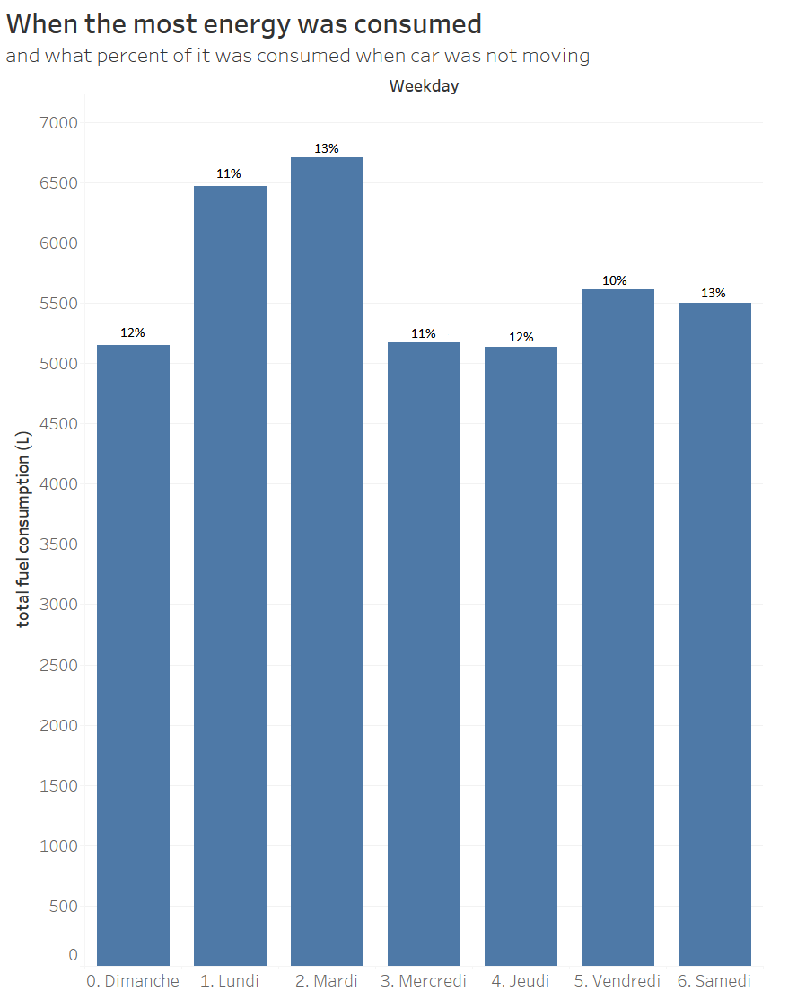

# cars-sensor-data-viz
Analysis of sensor data to better understand different car models' harm to environment.

The dataset is collected from car sensors and has 103.625 rows. 

1. How much CO2 is produced each day

From the dataste I can know when is the most energy consumed, like how much gas they used, so I multiplied the amount of gas by amount of carbon dioxide that is produced by each liter of gas to see which model is the most harmful for the environment. 

2. Cost of fuel per kilometer

I multipled amount of fuel by its cost to undertand the cost of fuel for each model of cars.

3. 

When is the most energy consumed and the percent of energy that is consumed when the car is not moving. (which means that people are not driving or moving with the car but they didn't turn off the engine for other usage, for example, air conditioner)
From this chart we can see how much energy people are still consuming even when they are not actually driving, and give suggestions to act on it.
